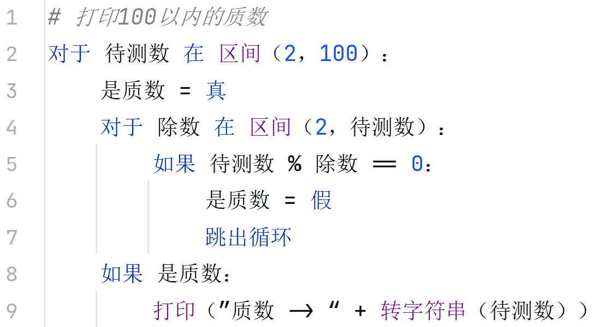

# 丁真


## 介绍
丁真语言，使用**Python**作为**底层宏**替换编写而成的**中文编程语言**，后缀名为`dj`。

具体语法可查看`test`文件夹的一系列`.dj`文件。


## 编程风格




## 用法
1. 克隆该仓库

2. 编写丁真语言文件（比如xxx.dj）

3. 在仓库的`bin`目录下，可以用两种方式运行：
   + 直接在资源管理器将`xxx.dj`拖拽到`dingzhen_drag.cmd`运行
   
   + 用**cmd**调用`dingzhen.cmd`运行：
   
     ```cmd
     dingzhen /path/to/xxx.dj 
     ```
